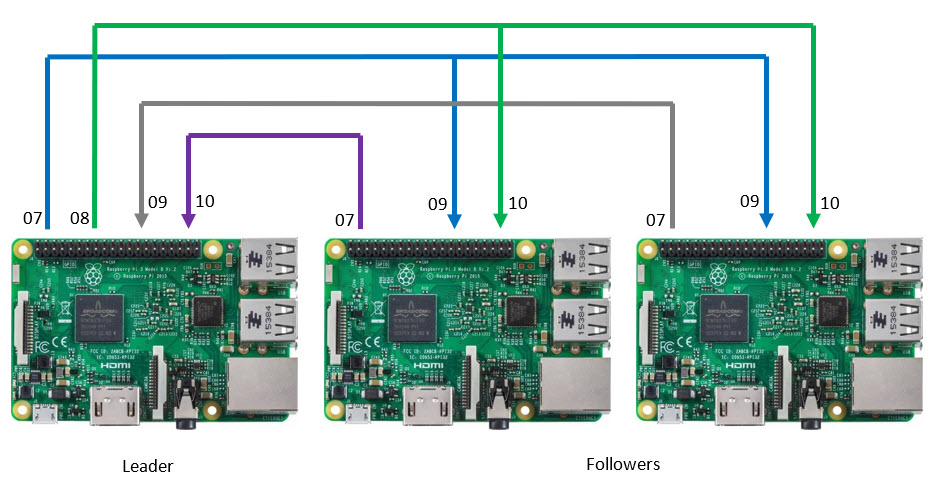

# rgb-megabugs
Megabugs on an Adafruit six 64x32 (6mm pitch) RGB grid.

That's six of these babies:
https://www.adafruit.com/product/2276

That makes a 128x96 pixel display -- exactly the same as megabugs on the CoCo.

Adafruit tutorial: 
https://learn.adafruit.com/adafruit-rgb-matrix-bonnet-for-raspberry-pi/

Bonnet: 
https://www.adafruit.com/product/3211

Multiple panels: 
https://github.com/hzeller/rpi-rgb-led-matrix#panel-connection

If I am reading this right:
  - `led-rows=32` Each panel has 32 rows
  - `led-cols=64` Each panel has 64 columns
  - `led-chains=2` Each chain has 2 panels (128x32)
  - `led-parallel=3` Three chains (128x96)
  
https://github.com/hzeller/rpi-rgb-led-matrix/blob/master/wiring.md

# Three PI version

