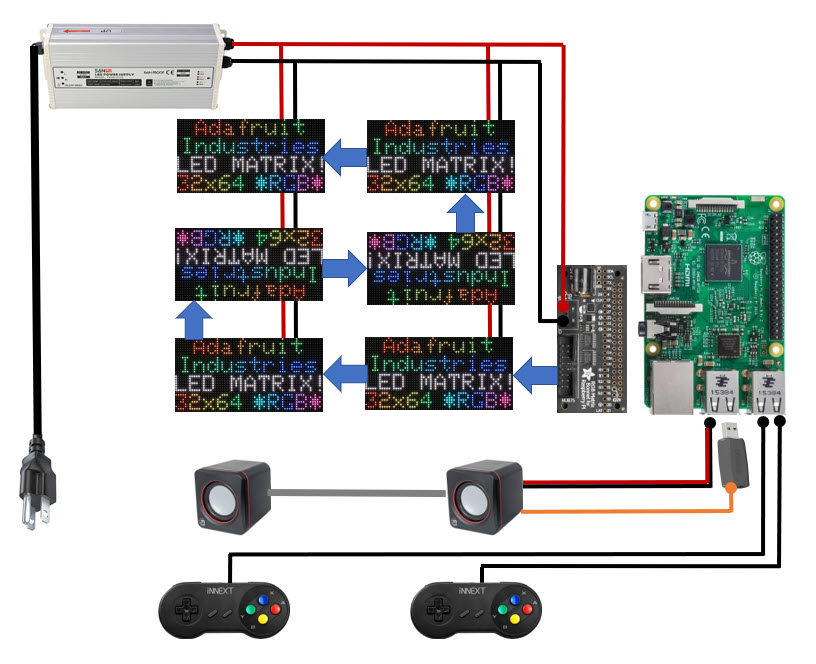

# Giga Bug

### As seen on Adafruit Show and Tell
  
https://youtu.be/emKlJVrhkvA?t=2841

## As seen on Youtube
  
https://www.youtube.com/watch?v=5VSp-PirvBE

## Reviving an old favorite

Reviving the old TRS80 Color Computer game "Mega-Bug" on a Raspberry Pi with an RGB matrix display.

I used a Raspberry Pi 3B+: [https://www.amazon.com/ELEMENT-Element14-Raspberry-Pi-Motherboard/dp/B07P4LSDYV](https://www.amazon.com/ELEMENT-Element14-Raspberry-Pi-Motherboard/dp/B07P4LSDYV).

I used six of these Adafruit panels to make the 128x96 display: [https://www.adafruit.com/product/2276](https://www.adafruit.com/product/2276). The final display is 30 x 22.5 inches.

I used the Adafruit RGB Matrix Bonnet for Raspberry Pi: [https://www.adafruit.com/product/3211](https://www.adafruit.com/product/3211). Adafruit has an extensive tutorial on wiring, drivers, and
demos for the display: [https://learn.adafruit.com/adafruit-rgb-matrix-bonnet-for-raspberry-pi/](https://learn.adafruit.com/adafruit-rgb-matrix-bonnet-for-raspberry-pi/)

I covered the display with a 20x22.5 sheet of Chemcast Black LED Acrylic from TAP Plastics. TAP custom cut the sheet and shipped it to me: [https://www.tapplastics.com/black_led_sheet](https://www.tapplastics.com/black_led_sheet).

I made the frame with boards and metal braces from my local Lowe's hardware store. See my discussion of the construction below.

I used a 5V 60A LED driver to power the entire project: [https://www.amazon.com/gp/product/B07G7S44CW](https://www.amazon.com/gp/product/B07G7S44CW). I'm sure there are better options for this indoor project.

The Pi has native sound, but the display board all of the Pi hardware. I used a USB sound card for sound: [https://www.amazon.com/gp/product/B07DBNFZJR](https://www.amazon.com/gp/product/B07DBNFZJR). 

I used a pair of USB-powered speakers I found at Walmart. Something similar to: [https://www.amazon.com/AmazonBasics-Computer-Speakers-Desktop-USB-Powered/dp/B07D7TV5J3](https://www.amazon.com/AmazonBasics-Computer-Speakers-Desktop-USB-Powered/dp/B07D7TV5J3).

I used a pair of USB gamepad controllers: [https://www.amazon.com/iNNEXT-Controller-Joystick-Gamestick-Raspberry/dp/B01N7ANDLC](https://www.amazon.com/iNNEXT-Controller-Joystick-Gamestick-Raspberry/dp/B01N7ANDLC)

The software is all python. See my discussion of the software below.

## Block Diagram

## Constructing the Frame

Exact dimension of the front for black LED acrylic from TAP Plastics: 30.25 x 22.625 inches.

# Software

[Disassembled CoCo Code](http://computerarcheology.com/CoCo/Megabug/Code.html)

[Live Play](https://www.youtube.com/watch?v=TQK982Kbe0s&t=16s)

[Dung Beetles](https://www.youtube.com/watch?v=DlIxErE8Pgs)

The game resolution for the CoCo Mega-Bug is 128x96 in 4 colors. My display matches that resolution exactly.

Disable the sound module on the pi (you can still use USB sound cards):

`dtparam=audio=off` in `/boot/config.txt`

Still doesn't work for me. I have to use "no hardware pulse" or I get long color bar flickers.

Config parameters for the display library:

  - options.hardware_mapping = 'adafruit-hat'
  - options.rows = 32 # 32 rows per display
  - options.cols = 64 # 64 rows per display (64x32)
  - options.chain_length = 6
  - options.parallel = 1
  - options.disable_hardware_pulsing = False
  - options.pwm_bits = 11
  - options.gpio_slowdown = 2
  - options.pwm_lsb_nanoseconds = 50
  
These need revisiting!
  
https://github.com/hzeller/rpi-rgb-led-matrix/blob/master/wiring.md
