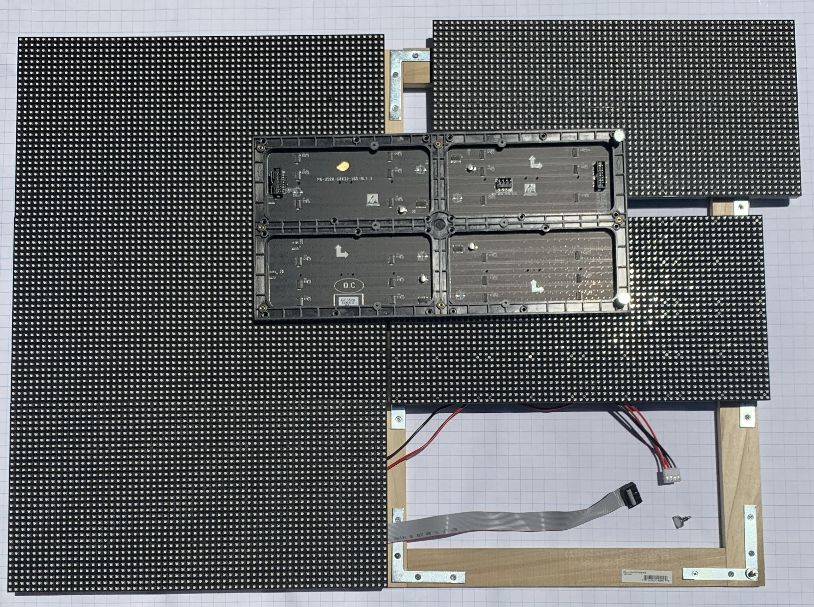

# Poo Bugs

Reviving the old TRS80 Color Computer game "Mega-Bug" on a Raspberry Pi with an RGB matrix display.

I used a Raspberry Pi 3B+: [https://www.amazon.com/ELEMENT-Element14-Raspberry-Pi-Motherboard/dp/B07P4LSDYV](https://www.amazon.com/ELEMENT-Element14-Raspberry-Pi-Motherboard/dp/B07P4LSDYV).

I used six of these Adafruit panels to make the 128x96 display: [https://www.adafruit.com/product/2276](https://www.adafruit.com/product/2276). The final display is 30 x 22.5 inches.

I used Henner Zeller's "active 3" board for the raspberry pi to drive the display: [https://github.com/hzeller/rpi-rgb-led-matrix/tree/master/adapter/active-3](https://github.com/hzeller/rpi-rgb-led-matrix/tree/master/adapter/active-3). The page has instructions for ordering boards from OSH Park. I got all the recommended parts from DigiKey. Follow links back up the repo for the code library, demos, and documentation.

I covered the display with a 20x22.5 sheet of Chemcast Black LED Acrylic from TAP Plastics. TAP custom cut the sheet and shipped it to me: [https://www.tapplastics.com/black_led_sheet](https://www.tapplastics.com/black_led_sheet).

I made the frame with boards and metal braces from my local Lowe's hardware store. See my discussion of the construction below.

I used a 5V 60A LED driver to power the entire project: [https://www.amazon.com/gp/product/B07G7S44CW](https://www.amazon.com/gp/product/B07G7S44CW). I'm sure there are better options for this indoor project.

The Pi has native sound, but the display board all of the Pi hardware. I used a USB sound card for sound: [https://www.amazon.com/gp/product/B07DBNFZJR](https://www.amazon.com/gp/product/B07DBNFZJR). 

I used a pair of USB-powered speakers I found at Walmart. Something similar to: [https://www.amazon.com/AmazonBasics-Computer-Speakers-Desktop-USB-Powered/dp/B07D7TV5J3](https://www.amazon.com/AmazonBasics-Computer-Speakers-Desktop-USB-Powered/dp/B07D7TV5J3).

I used a pair of USB gamepad controllers: [https://www.amazon.com/iNNEXT-Controller-Joystick-Gamestick-Raspberry/dp/B01N7ANDLC](https://www.amazon.com/iNNEXT-Controller-Joystick-Gamestick-Raspberry/dp/B01N7ANDLC)

The software is all python. See my discussion of the software below.

## Block Diagram


## Constructing the Frame

## The Software

[Disassembled CoCo Code](http://computerarcheology.com/CoCo/Megabug/Code.html)

[Live Play](https://www.youtube.com/watch?v=TQK982Kbe0s&t=16s)

[Dung Beetles](https://www.youtube.com/watch?v=DlIxErE8Pgs)

The game resolution for the CoCo Mega-Bug is 128x96 in 4 colors. My display matches that resolution exactly.


If I am reading this right:
  - `led-rows=32` Each panel has 32 rows
  - `led-cols=64` Each panel has 64 columns
  - `led-chains=2` Each chain has 2 panels (128x32)
  - `led-parallel=3` Three chains (128x96)
  
https://github.com/hzeller/rpi-rgb-led-matrix/blob/master/wiring.md

# The Frame



Exact dimension of the front for black LED acrylic from TAP Plastics: 30.25 x 22.625 inches.

# Software

Disable the sound module on the pi (you can still use USB sound cards):

`dtparam=audio=off` in `/boot/config.txt`

```
sudo ./demo -D0 --led-cols=64 --led-rows=32 --led-chain=2 --led-parallel=3 --led-no-hardware-pulse
```

Still doesn't work for me. I have to use "no hardware pulse" or I get long color bar flickers.

